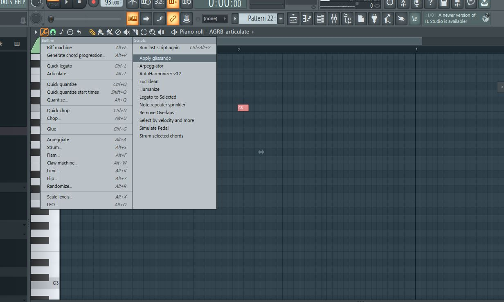
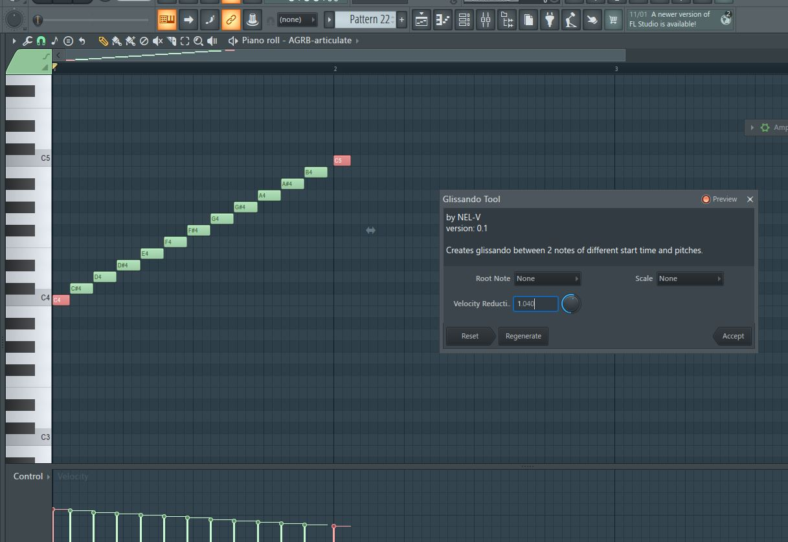
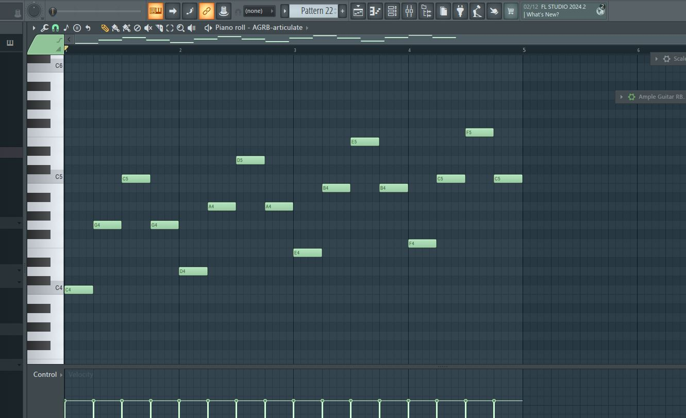
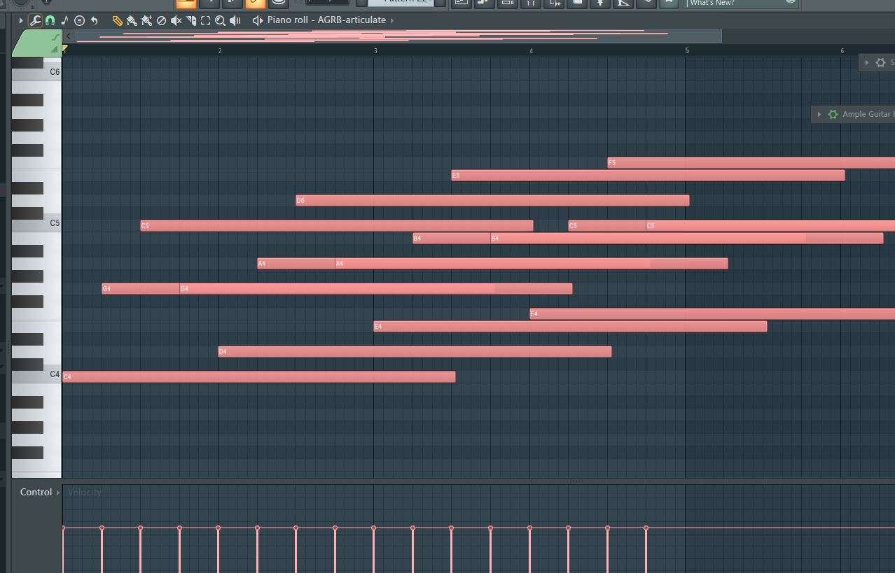
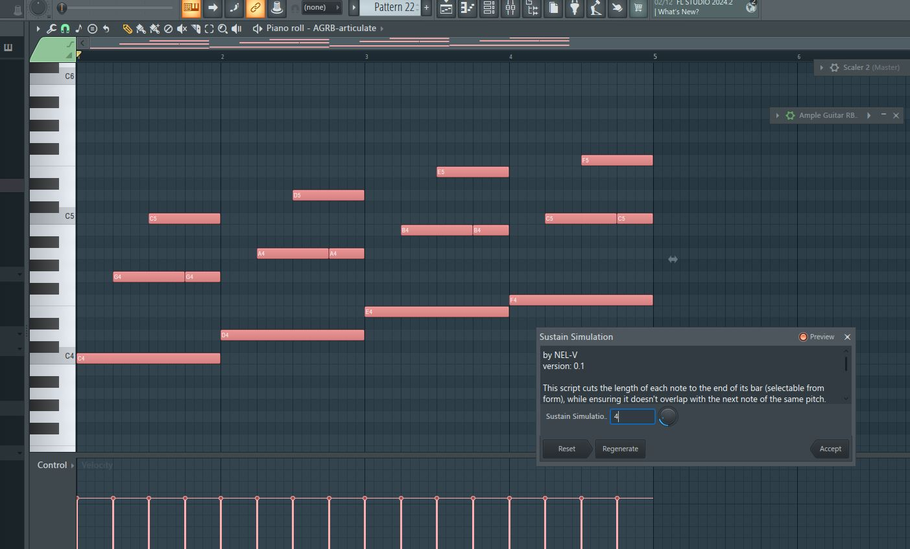
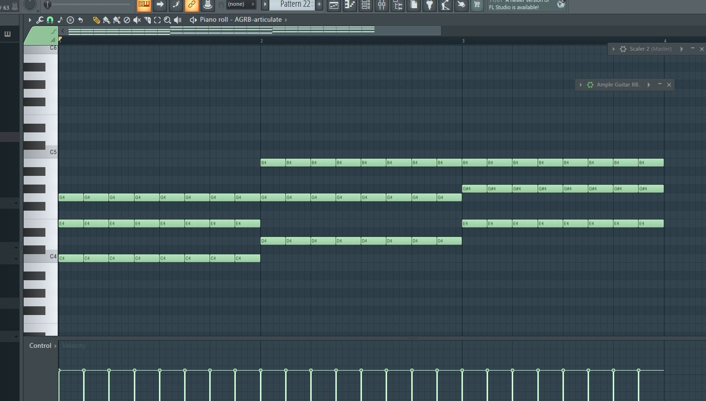
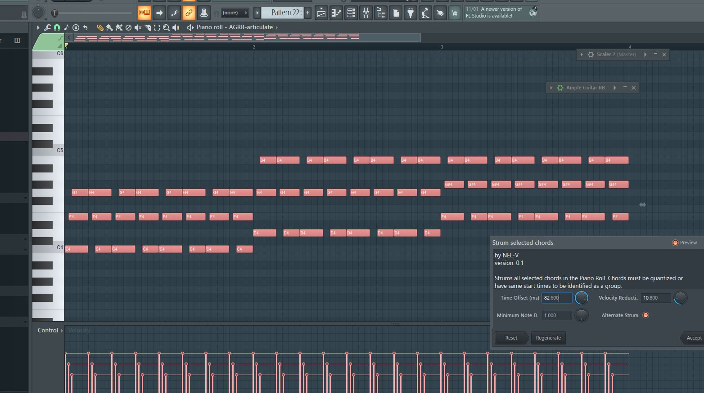
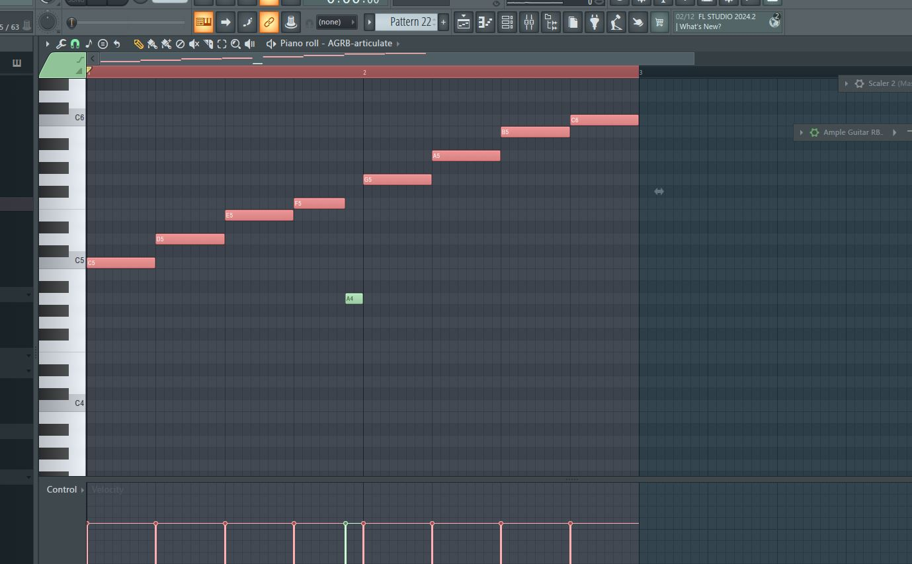
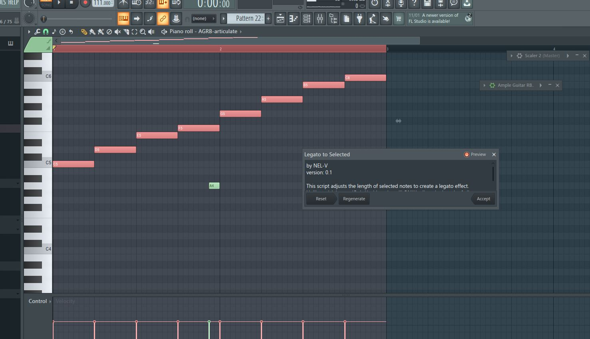

# FL Piano Roll PyScripts

## Usage
To use this preset, download the script file and paste them into your piano roll script folder. Typically, the directory is as follows: 

```
C:\Program Files\Image-Line\FL Studio 2024\System\Config\Piano roll scripts\your-script-name.pyscript
```

## Script Demo
### Apply glissando
1. Select two notes with different start times and pitches.
2. From piano roll "Tools", select "Apply glissando". You need the pyscript file to already be in the piano roll script folder.

3. Create a glissando effect between the two selected notes by filling in the notes in between pitches.


### Simulate Pedal
1. Select a group of arppegiated notes.

2. Lengthen the sustain of all notes as much as you need. Don't worry about overlapping notes.

3. From piano roll "Tools", select "Simulate Pedal" and apply the effect. Results: 


### Strum selected chords
1. Select a group of chopped chords in the piano roll.

2. From piano roll "Tools", select "Strum selected chords" and apply the strum effect. Example uses alternating strum, meaning the first chord is strummed with downstroke, and the second chord is strummed with upstroke.


### Legato to Selected
1. Apply legato to selected notes using FL's built-in legato tool (Ctrl+L) can be intercepted. (Example: A4 stopped the quick legato from connecting F5 to G5)

2. From piano roll "Tools", select "Legato to Selected" and connect only selected notes.

